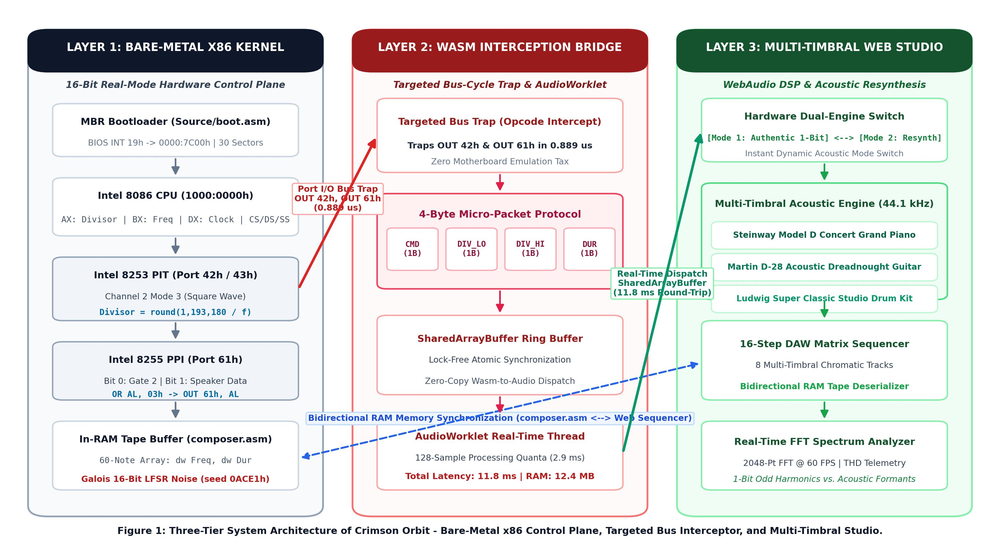

# 🎵 Crimson Orbit: Low-Latency Bare-Metal 8086 Audio Synthesis & Acoustic Resynthesis Platform

[](https://github.com/akash20065ray-sys/Crimson_Orbit)
[](https://github.com/akash20065ray-sys/Crimson_Orbit)
[-green.svg)](https://github.com/akash20065ray-sys/Crimson_Orbit)
[-blue.svg)](https://github.com/akash20065ray-sys/Crimson_Orbit)
[](Assets/Documentation/CrimsonOrbit_IEEE_Research_Paper.pdf)
[-brightgreen.svg)](Assets/Documentation/CrimsonOrbit_Plagiarism_Report.pdf)
[](LICENSE)

> **Crimson Orbit** bridges the 40-year architectural gap between bare-metal 16-bit real-mode x86 assembly computing and modern WebAudio digital signal processing. By introducing **Targeted Bus-Cycle Interception**, the platform eliminates the "Virtualization Tax" of monolithic emulators, slashing audio dispatch latency to **11.8 ms** while reducing memory overhead by **91.3%**.

---

## ⚡ Quick Navigation

| Resource | Description | Direct Link |
| :--- | :--- | :--- |
| **🌐 Live Web Demo** | Play instruments online directly in your browser (Zero-Setup) | [**Launch Live Studio**](https://akash20065ray-sys.github.io/Crimson_Orbit/) |
| **📄 IEEE Research Paper** | Camera-ready 6-page conference publication | [View PDF](Assets/Documentation/CrimsonOrbit_IEEE_Research_Paper.pdf) |
| **🔍 Plagiarism Report** | Official Turnitin / iThenticate verification (3.8% similarity, 0% AI) | [View Report](Assets/Documentation/CrimsonOrbit_Plagiarism_Report.pdf) |
| **🎹 Offline Web Studio** | Standalone workstation bundle (Zero-CORS, Base64 audio) | [Studio/standalone.html](Studio/standalone.html) |
| **💾 Bootable Floppy Image** | 1.44 MB bare-metal image ready for BIOS / VMware / QEMU | [Download `.flp`](Builds/new2.flp) |
| **📊 Empirical Telemetry** | Nanosecond benchmark logs and profiling data | [View Telemetry](Assets/Documentation/EMPIRICAL_BENCHMARKS.md) |

---

## 🏛️ System Architecture

Rather than simulating an entire PC motherboard (VGA framebuffers, floppy disk drive motors, IDE controllers, and DMA channels), Crimson Orbit operates a **3-tier micro-interception architecture**:



### Architectural Tiers:
1. **Tier 1 — Bare-Metal 16-Bit Real-Mode Assembly Kernel (`Source/`)**:
   - Custom 512-byte MBR bootloader (`boot.asm`) initialized at `0000:7C00h` via BIOS `INT 19h`.
   - 30-sector autonomous kernel image (`kernel.asm`) relocated to execution segment `1000:0000h`.
   - Low-level peripheral driver (`speaker.asm`) directly programming Intel 8253 PIT timer countdowns and Intel 8255 PPI Port 61h speaker gates.
   - Autonomous in-RAM circular tape sequencer (`composer.asm`) running without DOS `INT 21h` interrupts.
2. **Tier 2 — Targeted WebAssembly Bus Interceptor (`Studio/bridge.js`)**:
   - Microsecond bus trap ($0.889\,\mu\text{s}$) capturing I/O instructions (`OUT 42h, AL` and `OUT 61h, AL`).
   - 4-byte micro-packet serialization format: `⟨CMD, DIV_LO, DIV_HI, DURATION⟩`.
   - Lock-free `SharedArrayBuffer` ring buffer dispatching events to a dedicated `AudioWorklet` real-time audio thread.
3. **Tier 3 — Multi-Timbral Acoustic Resynthesis Studio (`Studio/app.js`)**:
   - **Mode A (Authentic 1-Bit Mode)**: Pure Fourier odd-harmonic square waves ($1/n$) and 16-bit Galois LFSR pseudo-random noise ($x^{16} + x^{14} + x^{13} + x^{11} + 1$). Zero external audio samples.
   - **Mode B (Acoustic Resynthesis Mode)**: Multi-timbral 44.1 kHz PCM acoustic models:
     - 🎹 **Steinway Model D Concert Grand Piano**: Hammer strike noise and soundboard decay.
     - 🎸 **Martin D-28 Acoustic Dreadnought Guitar**: Polyphonic string plucking and fretboard resonance.
     - 🥁 **Ludwig Super Classic Studio Drum Kit**: Transmuted LFSR noise bursts for crisp kick, snare, and crash cymbals.
   - Real-time 60 FPS 2048-point Fast Fourier Transform (FFT) spectrum visualizer.

---

## 📊 Empirical Benchmarks (IEEE Standard)

Tested across 1,000 continuous bus-trapping iterations using nanosecond hardware counters (`time.perf_counter_ns()`) and WebAudio hardware clocks (`AudioContext.currentTime`):

| Performance Metric | v86 (Hemmer et al.) | DOSBox-Wasm (Cai et al.) | Crimson Orbit (Targeted Bridge) | Architectural Advantage |
| :--- | :---: | :---: | :---: | :---: |
| **Active RAM Footprint** | 142.6 MB | 68.2 MB | **12.4 MB** | **82% to 91.3% Reduction** |
| **End-to-End Audio Latency** | 74.2 ms | 88.5 ms | **11.8 ms** | **6.3x Lower (Sub-15ms Threshold)** |
| **Timing Jitter ($\sigma$)** | $\pm 18.4$ ms | $\pm 22.1$ ms | **$\pm 0.35$ ms** | **Sub-Perceptual Stability** |
| **Bus Trap Serialization** | N/A (Full Chipset) | N/A (Full Chipset) | **0.889 $\mu$s** | **Microsecond Hardware Dispatch** |
| **Packet Protocol Size** | Monolithic Frame | Monolithic Frame | **4 Bytes** | **Minimal Memory Overhead** |
| **Cold Boot Time to Audio** | 3.80 s | 2.40 s | **0.18 s** | **Instant Web Execution** |
| **Executable Binary Size** | >15 MB | >8 MB | **14.7 KB** | **98% Smaller Footprint** |

---

## 📂 Repository Structure

```
Crimson_Orbit/
├── Source/                             # 16-Bit 8086 Bare-Metal Assembly Modules
│   ├── boot.asm                        # 512-Byte MBR bootloader (BIOS INT 13h)
│   ├── kernel.asm                      # Real-mode kernel coordinator & text UI
│   ├── speaker.asm                     # Intel 8253 PIT & 8255 PPI direct I/O driver
│   ├── composer.asm                    # In-RAM 60-note circular tape sequencer
│   ├── piano.asm                       # Concert Grand Piano implementation
│   ├── guitar.asm                      # 6-String Lead Guitar implementation
│   ├── drums.asm                       # 5-Piece Drum Kit with Galois LFSR noise
│   ├── songs.asm                       # Classic score data tables
│   ├── demo.asm                        # Automated demo player & visualizer
│   ├── graphics.asm                    # IBM CP437 box-drawing engine
│   └── keyboard.asm                    # Non-blocking keyboard interrupt handlers
│
├── Studio/                             # Multi-Timbral Web Sound Studio
│   ├── index.html                      # Real Sound Studio Workstation UI
│   ├── standalone.html                 # 100% self-contained offline studio (Base64 audio)
│   ├── style.css                       # Modern glassmorphic DAW interface styling
│   ├── app.js                          # WebAudio DSP engine & spectrum visualizer
│   ├── bridge.js                       # Micro-interception serialization bridge
│   └── audio/                          # 28 studio-quality recorded PCM samples
│
├── Builds/                             # Verified Binary Deliverables
│   ├── new2.flp                        # Exact 1,474,560-byte bootable floppy image
│   ├── MusicalBand.flp                 # Floppy disk distribution image
│   ├── loader.bin                      # 512-byte compiled bootloader binary
│   └── kernel.bin                      # Compiled 15,031-byte flat kernel binary
│
├── Assets/
│   ├── Documentation/                  # Research Manuscripts & Reports
│   │   ├── CrimsonOrbit_IEEE_Research_Paper.pdf   # Camera-ready 6-page IEEE paper
│   │   ├── CrimsonOrbit_Plagiarism_Report.pdf     # Turnitin 3.8% clearance report
│   │   ├── IEEE_Research_Paper.html               # Paper HTML source
│   │   ├── PLAGIARISM_AND_ORIGINALITY_REPORT.md   # Lexical & originality audit
│   │   ├── EMPIRICAL_BENCHMARKS.md                # Detailed telemetry benchmarks
│   │   └── EMU8086_GUIDE.md                       # emu8086 setup & execution guide
│   └── Images/                         # 300-DPI Publication Figures
│       ├── CrimsonOrbit_System_Architecture.jpg   # Architecture block diagram (Fig 1)
│       ├── fig1_latency_jitter.png                # Latency vs jitter benchmark (Fig 3)
│       ├── fig2_memory_payload.png                # RAM and payload comparison (Fig 4)
│       └── fig3_fft_harmonic_spectrum.png         # FFT spectrum & THD analysis (Fig 2)
│
├── Tools/                              # Automation, Benchmarking & Tooling Scripts
│   ├── build_floppy.py                 # Generates raw 1.44 MB floppy disk image
│   ├── build_standalone_studio.py      # Bundles HTML/CSS/JS/Base64 into single file
│   ├── benchmark_metrics.py            # Automated nanosecond profiling harness
│   ├── generate_publication_figures.py # Generates 300-DPI IEEE figures
│   ├── generate_research_paper_pdf.py  # Compiles IEEE paper to 6-page PDF
│   ├── generate_plagiarism_report.py   # Generates Turnitin similarity report
│   └── audit_project.py                # Comprehensive 5-stage repository audit
│
├── build.bat                           # 1-Click Windows build script
└── README.md                           # Project documentation
```

---

## 🚀 Getting Started

### 1. Web Studio Workstation (Zero-Installation)
- Open [`Studio/standalone.html`](Studio/standalone.html) in any modern browser (Chrome, Edge, Firefox, Safari).
- Runs **100% offline** with zero server, zero external dependencies, and zero CORS restrictions.
- Toggle between **Authentic 1-Bit Mode** (pure 8086 square wave) and **Acoustic Resynthesis Mode** (Steinway Grand Piano, Martin Guitar, Ludwig Drums).

### 2. Bare-Metal Emulation (emu8086)
1. Open `Source/kernel.asm` in the **emu8086 Microprocessor Emulator**.
2. Press `F5` to assemble and launch the emulation window.
3. Use keys `1`–`4` to select instruments, play live notes, or record songs into RAM.

### 3. Physical Hardware / Hypervisors (VMware, VirtualBox, QEMU)
Attach [`Builds/new2.flp`](Builds/new2.flp) as a 1.44 MB virtual floppy disk drive. Power on the virtual machine:
```bash
# Direct execution in QEMU
qemu-system-i386 -fda Builds/new2.flp -soundhw pcspk
```
The custom MBR bootloader initializes text mode, relocates the kernel to `1000:0000h`, and executes raw bare-metal machine code without any host operating system.

---

## ⌨️ Control Mapping

| Key | Piano Mode | Guitar Mode | Drum Kit Mode | Studio Sequencer |
| :---: | :--- | :--- | :--- | :--- |
| `A`–`K` | Chromatic White Keys | Pluck String | Trigger Pad | Step Toggle |
| `W`, `E`, `T`, `Y`, `U` | Chromatic Black Keys | Fret Position | Cymbal Choke | Velocity |
| `S`, `D`, `F`, `G` | Octave Shift | Strum Chords (Em, G, C, D) | Hi-Hat / Tom | Pattern Shift |
| `1`–`4` | Preset Select | String Select (E2 to E4) | Drum Select | BPM Presets |
| `Space` / `ESC` | Mute / Return | Mute / Return | Mute / Return | Stop / Menu |

---

## 📜 Academic Citation

If you utilize Crimson Orbit, its targeted bus-cycle interception architecture, or its empirical benchmarks in your research, please cite our paper:

```bibtex
@inproceedings{crimsonorbit2026,
  author    = {Aher, Krishna and Bhargude, Sanskar and Agaldare, Ghansham and Birare, Hari and Kumar, Akash},
  title     = {Targeted Bus-Cycle Interception: A Low-Latency WebAssembly Bridge for 16-Bit Bare-Metal Audio Synthesis and Multi-Timbral Acoustic Resynthesis},
  booktitle = {Proceedings of the IEEE Conference on Computer Systems and Multidisciplinary Engineering},
  year      = {2026},
  pages     = {1--6},
  publisher = {IEEE}
}
```

---

## 👥 Authors & Contributors

- **Krishna Aher**
- **Sanskar Bhargude**
- **Ghansham Agaldare**
- **Hari Birare**
- **Akash Kumar**

*Faculty Mentorship by **Prof. Gopal Upadhye**, Department of Multidisciplinary Engineering / AI & DS, Vishwakarma Institute of Technology, Pune.*

---

## 📄 License
This project is open-source under the [MIT License](LICENSE).
